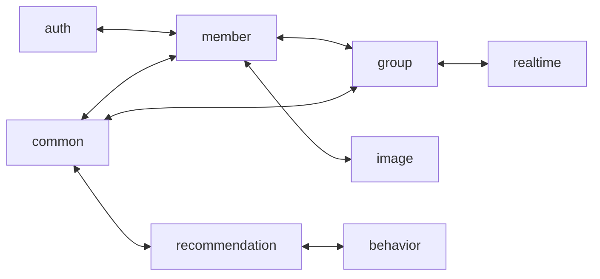
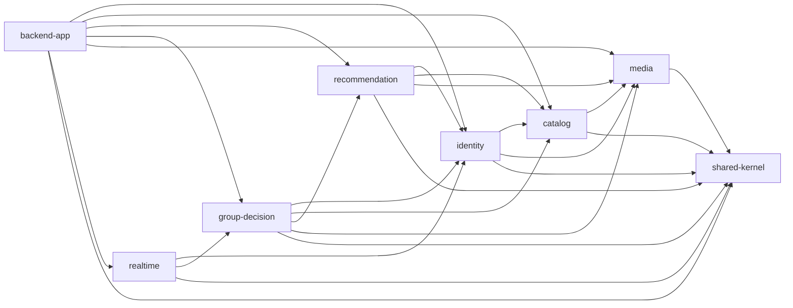

# 백엔드 모듈 경계·의존성 지도

## 기준과 상태

- 상태: 전환 전 조사·확정 설계 기록. 현재 의존성은 조사 시점의 사실이고, 제안 모듈은 2026-10-05 사용자 결정에 따른 전환 목표입니다.
- 확인일: 2026-10-05 (Asia/Seoul, 코드 조사 10-04~05).
- backend 기준 커밋: `0f6a966e32da6f41c0f3af81f4320d84d7d3cc96`.
- 코드 근거 링크는 조사 기준 커밋에 고정했습니다. 구현 이후의 개발 기준과 현재 구조는 루트 `docs/`와 backend 코드를 확인합니다.
- 조사 시 backend 작업 트리: 추적 파일 변경 없음, 미추적 `.run/` 존재. `.run/`은 조사 대상에서 제외했습니다.
- 범위: backend의 `api`, `domain`, `global`, `infra`, Gradle·배포 설정과 관련 `docs/`.
- 확정: 단일 Boot JAR·단일 프로세스·공유 MySQL을 유지하는 모듈러 모놀리스가 초기 목표입니다.
- 현재 구조는 단일 Gradle 프로젝트입니다. 아래 현재 지도는 패키지 의존이지 실제 Gradle 모듈 의존이 아닙니다.
- 짝 문서: [트랜잭션 분류표](./backend-transaction-classification.md).
- 변경 금지 조건: API Request/Response 요구사항을 유지합니다. 필드·타입·필수성·검증·null 의미, HTTP 상태·오류 코드·응답 envelope, 인증 관련 응답·SSE event type/payload와 성공 응답 시 완료되는 업무 범위를 보존합니다. 내부 command/result/event는 이 외부 계약을 보존하는 범위에서 변경할 수 있습니다.

## 현재 의존성

`domain/*` Java 파일의 일반·static import를 대상으로 다른 도메인 패키지 참조를 확인했습니다.
완전 수식 이름, 리플렉션, 빈 wiring, DB FK와 런타임 호출은 이 import 지도만으로 판정할 수 없습니다.

| 현재 패키지 | 직접 참조하는 다른 domain 패키지 |
| --- | --- |
| `auth` | `common`, `member` |
| `member` | `auth`, `common`, `group`, `image`, `menu`, `recommendation` |
| `menu` | `common`, `image` |
| `image` | `common`, `member` |
| `recommendation` | `behavior`, `common`, `image`, `member`, `menu` |
| `behavior` | `common`, `member`, `menu`, `recommendation` |
| `group` | `common`, `image`, `member`, `menu`, `realtime`, `recommendation` |
| `realtime` | `group`, `member` |
| `common` | `group`, `member`, `recommendation` |

주요 양방향 참조만 그리면 아래와 같습니다. 전체 의존 목록은 위 표입니다.

| 결합 지점 | 현재 사실 | 초기 처리 제안 |
| --- | --- | --- |
| `auth ↔ member` | 인증이 회원 엔티티·저장소를 사용하고 회원 가입·약관이 인증 토큰 처리에 의존 | 초기 `identity`에 함께 두고 내부 책임을 구분 |
| `member ↔ group` | 그룹은 회원을 참조하고 회원 탈퇴가 소유 그룹을 직접 삭제 상태로 변경 | 탈퇴 조합을 `backend-app`으로 이동, 공개 명령을 같은 DB 트랜잭션으로 실행 |
| `member ↔ image` | 회원은 이미지 자산을 참조하고 프리셋 삭제가 회원 프로필 이미지를 기본 자산으로 일괄 변경 | 삭제된 프리셋 사용 회원 전원을 기본 이미지로 재지정. 프리셋 삭제 조합은 `backend-app`, 자기 데이터 변경은 `identity`와 `media` |
| `recommendation ↔ behavior` | 추천 선택·재요청이 CHOOSE/SKIP 이력을 저장하고 행동 엔티티는 개인 추천을 참조 | 초기 `recommendation`에 함께 소유. 이력은 다음 추천의 입력이라 즉시 정합성 유지 |
| `group ↔ realtime` | 그룹 서비스 3개가 realtime 이벤트 타입을 발행하고 realtime은 그룹 result·저장소를 참조 | 이벤트를 그룹 공개 계약으로 이동, realtime은 공개 이벤트·조회 계약만 참조 |
| `common ↔ 업무 도메인` | 감사 기반 엔티티와 홈 화면 조합 서비스가 같은 common 패키지에 공존 | 감사 기반 타입은 `shared-kernel`, 홈 조합·HTTP 응답 매핑은 `backend-app`으로 분리 |
| `member → recommendation` | 회원 홈 정보가 개인 추천 저장소를 직접 조회 | 추천 수·요약 조회를 추천 공개 계약으로 제공하고 홈 조합에서 결합 |
| 다른 영역의 Entity·Q 타입 | 그룹·회원·메뉴·추천 조회에 다른 영역의 JPA 객체와 QueryDSL Q 타입 직접 참조 존재 | 공개 조회 모델·bulk 조회로 전환. 필요한 FK는 유지하고 Java 내부 구현 노출을 줄임 |

위 사실의 근거는 [그룹 추천](https://github.com/matchuri/backend/blob/0f6a966e32da6f41c0f3af81f4320d84d7d3cc96/src/main/java/matchuri/backend/domain/group/service/impl/GroupRecommendationServiceImpl.java), [회원 탈퇴](https://github.com/matchuri/backend/blob/0f6a966e32da6f41c0f3af81f4320d84d7d3cc96/src/main/java/matchuri/backend/domain/member/support/deletion/MemberWithdrawalManager.java), [프리셋 삭제](https://github.com/matchuri/backend/blob/0f6a966e32da6f41c0f3af81f4320d84d7d3cc96/src/main/java/matchuri/backend/domain/image/service/PresetProfileImageAdminServiceImpl.java), [개인 추천](https://github.com/matchuri/backend/blob/0f6a966e32da6f41c0f3af81f4320d84d7d3cc96/src/main/java/matchuri/backend/domain/recommendation/service/RecommendationServiceImpl.java), [홈 조합](https://github.com/matchuri/backend/blob/0f6a966e32da6f41c0f3af81f4320d84d7d3cc96/src/main/java/matchuri/backend/domain/common/service/CommonApplicationService.java)입니다.

## 제안 모듈 경계

아래 8개 모듈 구분과 이름을 초기 전환 목표로 채택합니다. 물리적인 Gradle 디렉터리로 옮기기 전에 단일 프로젝트 안에서 공개 계약과 내부 패키지 경계를 먼저 검증합니다.
초기에는 현재 서비스·JPA 계층을 각 업무 모듈 내부에 유지할 수 있습니다.

| 모듈 ID | 책임과 데이터 소유권 | 공개 계약 예시 (제안) | 허용 의존 |
| --- | --- | --- | --- |
| `backend-app` | 실행 진입점, HTTP Controller·DTO·Mapper, Security filter/config, 설정 wiring, 홈·탈퇴·프리셋 삭제 조합, seed 기동 조합 | HTTP·SSE 계약과 상위 유스케이스 | 모든 아래 모듈 |
| `identity` | 회원·인증·약관·위치·취향·회원 프로필 이미지 연결, refresh/exchange/email verification 데이터 | 활성 회원·취향 snapshot 조회, 가입·토큰·약관 명령, 회원 비활성화·프로필 이미지 재지정 | `catalog`, `media`, `shared-kernel` |
| `catalog` | 메뉴·속성·재료와 매핑, 메뉴 이미지 연결, 메뉴 관리 규칙 | 메뉴 후보 입력 bulk 조회, 기준 데이터 조회·검증, 메뉴 관리 명령 | `media`, `shared-kernel` |
| `recommendation` | 개인 추천·후보·선택·CHOOSE/SKIP 이력, 개인·그룹·비회원 계산 정책 | 개인 추천 유스케이스·홈 요약 조회, 불변 입력 기반 추천 계산 계약 | `identity`, `catalog`, `media`, `shared-kernel` |
| `group-decision` | 그룹·멤버십·초대·위치·presence·그룹 추천·준비·후보·카테고리·투표·확정 | 그룹 유스케이스, 활성 수신자·멤버십 조회, 그룹 도메인 이벤트 | `identity`, `catalog`, `recommendation`, `media`, `shared-kernel` |
| `media` | 이미지 자산·프리셋·기본 프리셋 규칙, 업로드 검증·URL·스토리지 연동 | 이미지·프리셋 조회, 업로드, 기본 지정, 프리셋 삭제의 자기 데이터 변경 | `shared-kernel` |
| `realtime` | 그룹 도메인 이벤트를 SSE payload로 변환, 연결·heartbeat·전송 실패 처리 | SSE 연결·전달 서비스. 영속 업무 상태 소유 없음 | `identity`, `group-decision`, `shared-kernel` |
| `shared-kernel` | 좁은 공통 오류 계약·감사 기반 타입 등 업무 도메인을 참조하지 않는 타입 | 공통 기반 타입 | 없음 |

`recommendation`의 그룹 계산은 `group-decision` Entity·Repository·result를 참조하지 않습니다.
기존 `TasteProfileSnapshot`, `MenuRecommendationProfile` 계열 입력을 활용하고, `CategoryType`처럼 필요한 분류는 catalog 공개 값 타입으로 다룹니다.
향후 독립 계산 모듈이 필요하면 계산 계약을 별도 추출할 수 있지만 초기 분리의 필수 조건은 아닙니다.

`global`과 `infra`를 통째로 공통 모듈에 옮기지 않습니다.
JWT·인증 지원은 identity, 저장소 클라이언트는 media, HTTP 오류 변환·필터·전역 wiring은 app처럼 실제 변경 책임을 기준으로 나눕니다.
seed의 여러 도메인 조합은 app에 두되 실제 기준 데이터 생성은 소유 모듈의 공개 명령을 사용합니다.

## 제안 의존성

화살표 `A --> B`는 A가 B의 공개 Java 계약에 컴파일 의존한다는 뜻입니다.
일반 호출과 이벤트 타입 참조를 포함하며 런타임 이벤트 전달 방향을 표현하지 않습니다. 모든 업무 모듈은 app을 참조하지 않습니다.

예를 들어 `GroupRecommendationFinalized`는 group-decision이 소유하는 공개 이벤트 이름 후보입니다.
런타임에서는 그룹이 발행하고 realtime이 소비하지만 컴파일 의존은 `realtime → group-decision`입니다.
현재 `GroupRecommendationFinalizedRealtimeEvent`와 SSE payload·envelope는 역할을 구분해 이전하고, 기존 외부 event type·payload 계약을 보존합니다.

공개 계약은 서비스 입출력 값·조회 snapshot·도메인 이벤트만 노출합니다.
다른 모듈의 `service/impl`, `support`, `repository`, Entity, QueryDSL Q 타입 직접 참조는 목표 구조의 경계 위반으로 봅니다.
상호 호출이 필수인 작업은 app 조합으로 올리거나 같은 모듈에 묶는 판단을 먼저 합니다.

## 경계별 정합성

| 흐름 | 원자성을 보존할 주체 | 경계 판단 |
| --- | --- | --- |
| 회원 가입·약관·인증 토큰 소비 | identity | 같은 회원 생성 흐름이며 초기에는 같은 모듈·트랜잭션 |
| 회원 탈퇴·인증 토큰 제거·소유 그룹 soft delete | app 상위 트랜잭션 + identity/group 공개 명령 | 현재 요청 완료 시의 즉시성을 유지. 소비자가 나중에 실행되는 이벤트 전환은 별도 정책 결정 |
| 프리셋 삭제·사용 회원의 기본 이미지 재지정 | app 상위 트랜잭션 + media/identity 공개 명령 | 삭제된 프리셋을 사용하던 회원 전원을 기본 이미지로 변경하는 방식 확정. 프리셋·자산의 보존과 회원 연결 재지정을 구분 |
| 추천 생성·후보·투표·최종 확정 | 해당 recommendation/group 모듈 | 주 상태와 후보·투표 관계는 해당 모듈 안에 유지 |
| 개인 추천 선택·SKIP/CHOOSE 이력 | recommendation | 다음 추천 제외 조건에 사용되므로 초기에는 같은 트랜잭션 |
| 확정 이후 화면 갱신 알림 | realtime | 커밋 후 부수 효과. 전송 실패로 완료된 업무 상태를 되돌리지 않음 |
| 회원 물리 삭제와 여러 도메인의 종속 데이터 | identity purge + 공유 DB FK cascade | 현행 삭제 정책의 명시적 예외. 모듈화만으로 FK를 제거하거나 비동기 삭제로 바꾸지 않음 |
| 홈 조회 | app 조합 | 현재 개인·그룹 추천 lazy expiration이 포함되어 쓰기 트랜잭션임 |

공유 DB에서 FK와 cascade는 유지할 수 있습니다. 모듈 경계와 DB 분리를 같은 변경으로 취급하지 않습니다.
다른 모듈 엔티티 참조를 ID·조회 snapshot으로 바꾸는 경우에도 FK·unique·삭제 정책을 별도로 보존해야 합니다.
QueryDSL join을 bulk 공개 조회로 바꿀 때는 응답 내용과 쿼리 수·지연 변화도 확인합니다.

## 결정 사항

| ID | 항목 | 확정 내용·적용 범위 |
| --- | --- | --- |
| D01 | 배포 단위 | 사용자 확정: 단일 배포·단일 Boot JAR·공유 DB |
| D02 | 물리 모듈 구분 | 권고안 채택: 위 8개 모듈. auth/member는 identity, recommendation/behavior는 recommendation에 함께 소유 |
| D03 | 도메인 이벤트 소유 위치 | 권고안 채택: 발행 업무 모듈의 공개 계약. SSE payload는 realtime 변환 책임 |
| D04 | 프리셋 삭제 정책 | C01에 따라 삭제된 프리셋 사용 회원 전원을 기본 이미지로 재지정 |
| D05 | 조회의 상태 저장 | 사용자 확정: 현행 lazy expiration 저장 유지. 분리·최적화는 이후 성능 개선 범위 |
| D06 | 이벤트 신뢰성 | 현행 best-effort·원래 실행 시점 유지. C04에 따라 보상·영속 전달·재처리 전략 재정의는 후속 범위 |
| D07 | 구조 검증 도구 | 사용자 확정: Spring Modulith. Boot 4 호환 버전·업무 모듈 탐지·공개 인터페이스를 설정. 현재 api/domain/global/infra를 그대로 업무 모듈로 취급하지 않음 |
| D08 | 실행·생성 코드 | 권고안 채택: app bootJar 하나, Entity/Repository/config 스캔과 모듈별 QueryDSL 생성·배포 경로 검증 |

첫 구조 전환은 `그룹 최종 확정 → 그룹 공개 이벤트 → realtime SSE 변환`으로 정합니다.
선행 조건은 기존 HTTP/SSE 동작 회귀 검증, C02의 실패 기록·업무 rollback 경계, 업무 단위 Spring Modulith 탐지와 공개 계약입니다.
최종 확정과 성공 응답의 완료 의미를 유지하고 이벤트 소유권·realtime의 그룹 내부 참조부터 정리합니다.
이번 단계는 명시적 비동기화·보상 전략·동시성 고도화를 확대하지 않습니다. 기존 unique·lock·권한 검증은 보존합니다.

## 근거

- [현재 아키텍처](../../../docs/backend/architecture.md), [구현 가이드](../../../docs/backend/guide.md), [데이터 정책](../../../docs/data/policies.md), [SSE 계약](../../../docs/api/realtime.md).
- [Gradle 프로젝트 설정](https://github.com/matchuri/backend/blob/0f6a966e32da6f41c0f3af81f4320d84d7d3cc96/settings.gradle.kts), [빌드·테스트·QueryDSL 설정](https://github.com/matchuri/backend/blob/0f6a966e32da6f41c0f3af81f4320d84d7d3cc96/build.gradle.kts), [실행 JAR 탐색](https://github.com/matchuri/backend/blob/0f6a966e32da6f41c0f3af81f4320d84d7d3cc96/scripts/deploy/resolve-release-metadata.sh).
- [회원 서비스](https://github.com/matchuri/backend/blob/0f6a966e32da6f41c0f3af81f4320d84d7d3cc96/src/main/java/matchuri/backend/domain/member/service/MemberServiceImpl.java), [인증 서비스](https://github.com/matchuri/backend/blob/0f6a966e32da6f41c0f3af81f4320d84d7d3cc96/src/main/java/matchuri/backend/domain/auth/service/AuthServiceImpl.java).
- [그룹 후보 생성](https://github.com/matchuri/backend/blob/0f6a966e32da6f41c0f3af81f4320d84d7d3cc96/src/main/java/matchuri/backend/domain/group/support/recommendation/GroupRecommendationCandidateGenerator.java), [그룹 실시간 리스너](https://github.com/matchuri/backend/blob/0f6a966e32da6f41c0f3af81f4320d84d7d3cc96/src/main/java/matchuri/backend/domain/realtime/service/RealtimeDomainEventListener.java).
- [메뉴 조회의 이미지 Q 타입 join](https://github.com/matchuri/backend/blob/0f6a966e32da6f41c0f3af81f4320d84d7d3cc96/src/main/java/matchuri/backend/domain/menu/repository/impl/MenuItemRepositoryImpl.java), [홈의 이미지 Q 타입 join](https://github.com/matchuri/backend/blob/0f6a966e32da6f41c0f3af81f4320d84d7d3cc96/src/main/java/matchuri/backend/domain/member/repository/impl/MemberRepositoryImpl.java).
- [추천 공개 계산 입력](https://github.com/matchuri/backend/blob/0f6a966e32da6f41c0f3af81f4320d84d7d3cc96/src/main/java/matchuri/backend/domain/recommendation/algorithm/input/MenuRecommendationInput.java), [기존 구조 테스트의 범위](https://github.com/matchuri/backend/blob/0f6a966e32da6f41c0f3af81f4320d84d7d3cc96/src/test/java/matchuri/backend/domain/group/service/GroupServiceArchitectureTest.java).
- [Spring Modulith 구조 검증](https://docs.spring.io/spring-modulith/reference/verification.html): 모듈 순환, 내부 패키지 접근, 명시적 허용 의존 검증의 도구 근거.
